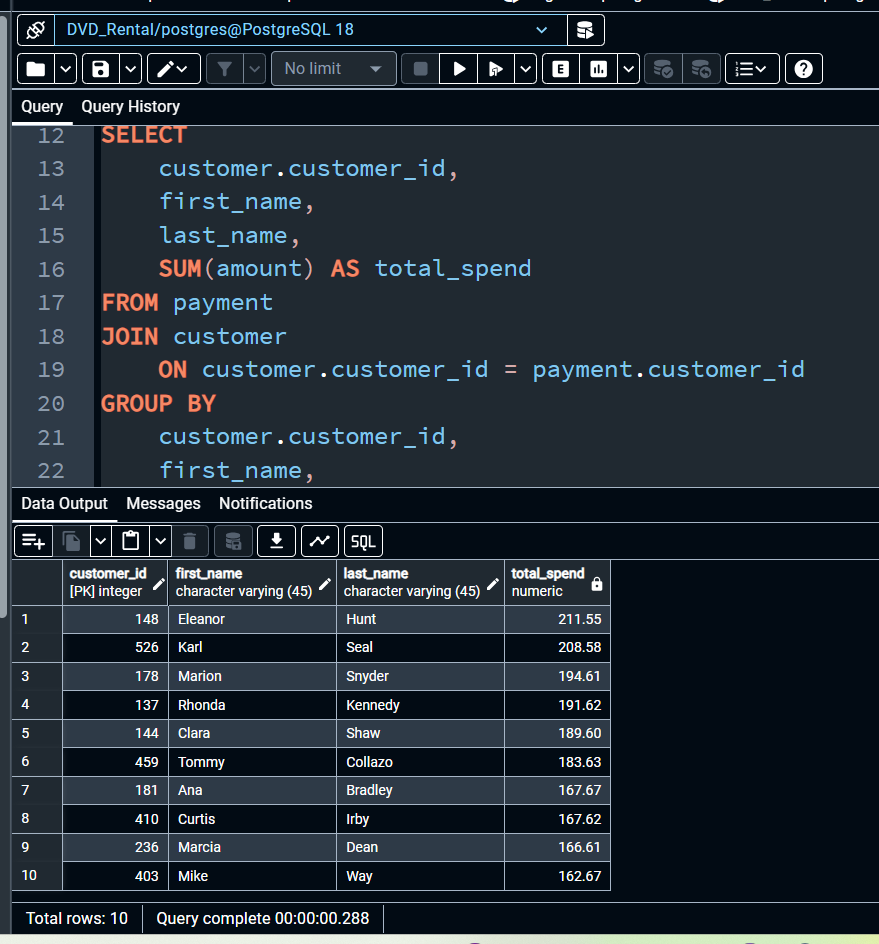
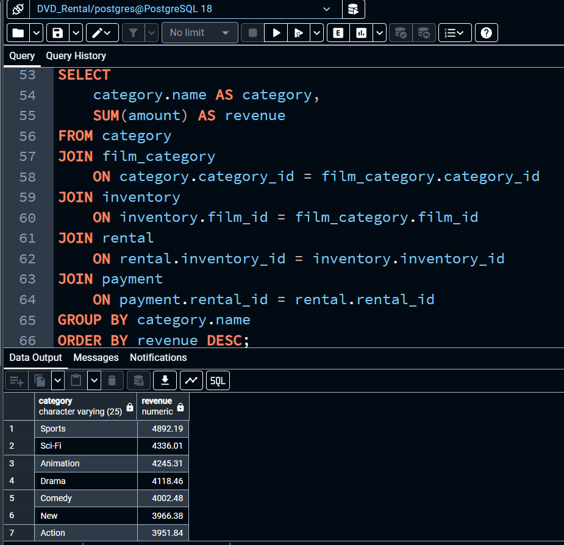
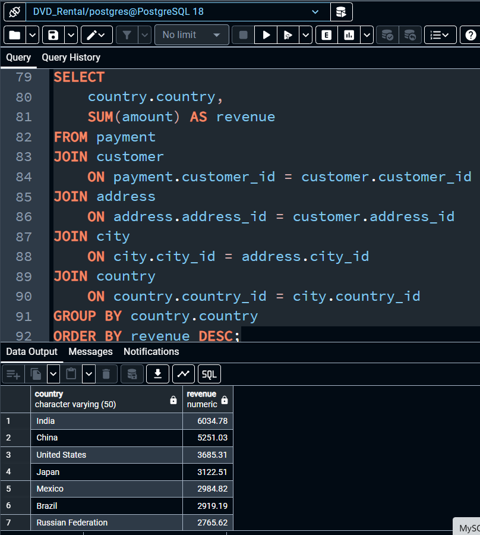

# DVD Rental SQL Analysis

This project analyzes the PostgreSQL **DVD Rental sample database** using SQL queries.

The goal of the analysis is to explore revenue patterns, customer behavior, and product performance.

## Technologies

- PostgreSQL
- SQL
- Jupyter Notebook

## Analysis Questions

1. Total revenue
2. Revenue per month
3. Top customers by revenue
4. Customers with the most rentals
5. Most rented films
6. Revenue by film category
7. Revenue by store
8. Revenue by country

## Example Analysis

### Top Customers by Revenue

### Revenue by Film Category

### Revenue by Country

## Dataset

The analysis uses the PostgreSQL **DVD Rental sample database**.

## Future Improvements

- Top customer in each country (window functions)
- Running revenue analysis
- Customer segmentation
